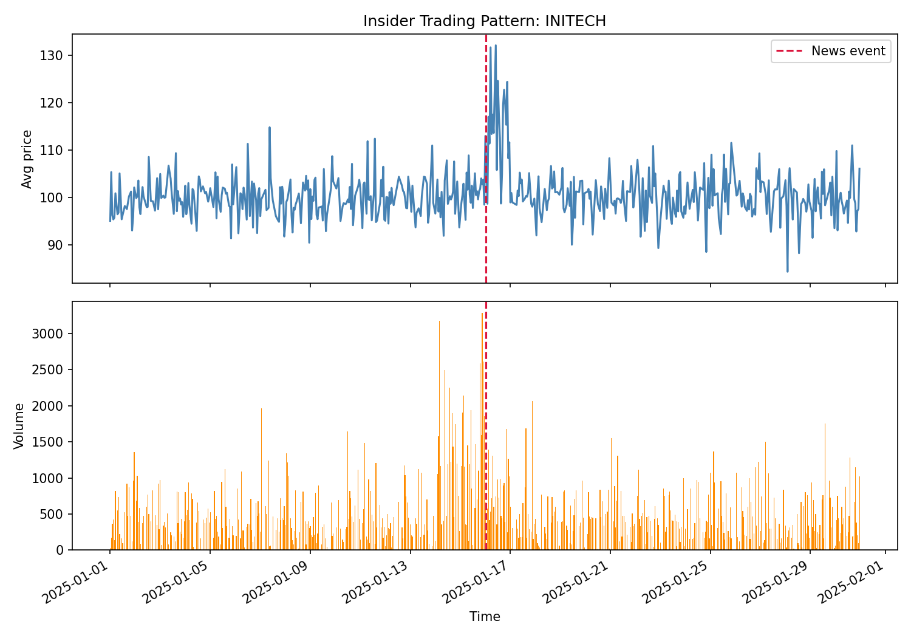
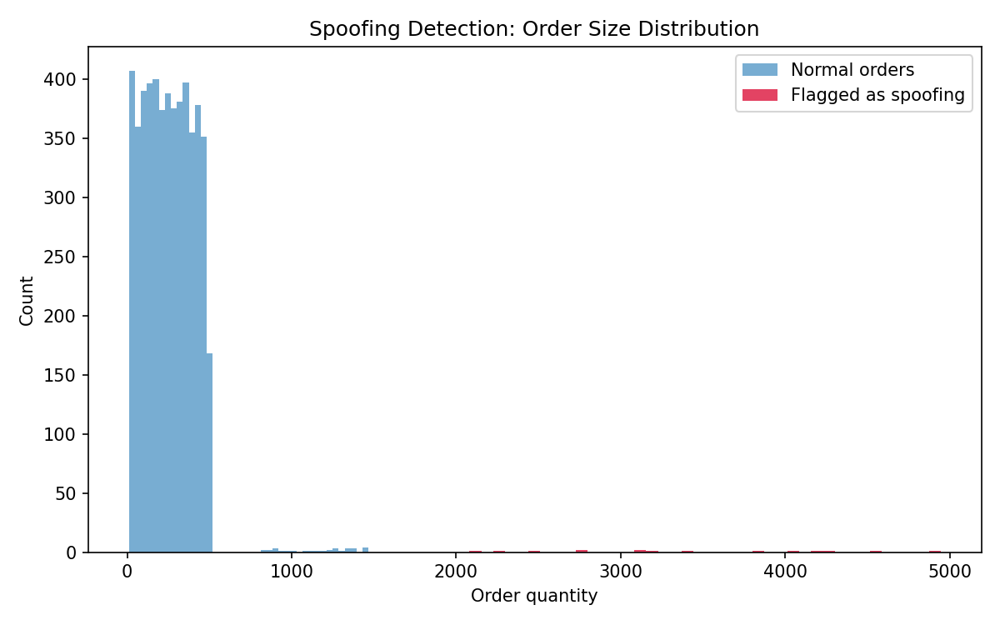

# Trade Surveillance Detection System

A demonstration project implementing detection algorithms for two classic trade surveillance patterns: **market manipulation** (spoofing and wash trading) and **insider trading** (abnormal pre-event accumulation).

Built to demonstrate applied understanding of surveillance methodology, not just general data science — the detection logic is designed around how these patterns actually manifest in order/trade data, and validated against synthetic data with known ground truth.

## Why this project

Trade surveillance systems exist to detect behavior that undermines fair and orderly markets. This project focuses on three patterns commonly targeted by regulatory frameworks such as the EU's **Market Abuse Regulation (MAR)** and the US **SEC/FINRA** rules on manipulative trading:

- **Spoofing** — placing large orders with no intention of execution, to create a false impression of supply/demand and move the market, then cancelling before the order fills.
- **Wash trading** — an account (or linked accounts) trading with itself, creating artificial volume without any real transfer of economic risk.
- **Insider trading** — trading ahead of material non-public information, visible as abnormal accumulation by a small cluster of accounts shortly before a price-moving event.

## Approach

Since real trade data is proprietary and not publicly available at this granularity, this project uses a **synthetic data generator** that creates realistic baseline order/trade activity and injects each manipulation pattern with known ground-truth labels. This allows the detection algorithms to be objectively validated (true/false positive rates) rather than just visually inspected.

### Detection methodology

| Pattern | Method |
|---|---|
| Spoofing | Z-score based outlier detection on order size, filtered to cancelled (non-executed) orders |
| Wash trading | Time-windowed pairwise matching of opposite-side trades with near-identical price/quantity across different accounts |
| Insider trading | Two-stage: (1) detect abnormal price/volume days via rolling z-scores, (2) within the pre-event window, flag accounts with abnormally large accumulation relative to peers |

See [`docs/methodology.md`](docs/methodology.md) for a more detailed writeup of each algorithm's logic and limitations.

## Results (on synthetic validation data)

| Detector | True Positives | False Positives | False Negatives |
|---|---|---|---|
| Spoofing | 15 / 15 | 0 | 0 |
| Wash trading | 80 / 80 | 0 | 0 |
| Insider trading | 2 / 4 accounts | 0 | 2 |

The insider trading detector intentionally has a stricter threshold, trading recall for precision — in a real surveillance context, false positives generate costly manual review workload, so a conservative threshold is a defensible design choice. This tradeoff (and how you'd tune it with real labeled outcome data) is discussed further in `docs/methodology.md`.

### Sample output

**Insider trading pattern** — accumulation before the event, price jump after:



**Spoofing detection** — flagged orders sit clearly outside the normal order-size distribution:



## Project structure

```
trade-surveillance/
├── README.md
├── requirements.txt
├── data/
│   └── raw/                       # generated synthetic data (gitignored)
├── src/
│   ├── data_generation/
│   │   └── generate_trades.py     # synthetic data + injected anomalies
│   └── detection/
│       ├── market_manipulation.py # spoofing + wash trading detectors
│       └── insider_trading.py     # insider trading detector
├── notebooks/
│   ├── run_full_report.py         # end-to-end demo script, generates charts
│   └── output/                    # generated charts + summary
├── tests/
│   └── test_detection.py          # validates detectors against ground truth
└── docs/
    └── methodology.md
```

## How to run it

```bash
git clone <repo-url>
cd trade-surveillance
pip install -r requirements.txt

# Run the full pipeline: generates data, runs detectors, produces charts
python notebooks/run_full_report.py

# Run the test suite
pytest tests/ -v
```

## Limitations & next steps

This is a demonstration project, not a production surveillance system. Notable simplifications:

- **Synthetic data**: real market data has far more noise, legitimate large orders, and legitimate correlated trading (e.g., market makers) that would increase false positive rates significantly.
- **Wash trading matcher is O(n²) in the worst case** per symbol — a production system would need a more scalable matching approach (e.g., graph-based account clustering) at real exchange volumes.
- **No cross-symbol or cross-venue correlation** — real insider trading detection often benefits from correlating options activity, related securities, and news/NLP signals, none of which are modeled here.
- **Static thresholds** — z-score thresholds are fixed; a production system would likely calibrate thresholds per-symbol based on liquidity/volatility profiles, and would be validated against confirmed historical enforcement cases rather than synthetic data alone.

Given more time, the natural next additions would be: a simple Streamlit dashboard for interactive review of flagged cases, a graph-based wash trading detector (to catch multi-hop circular trading beyond simple pairs), and backtesting against a public dataset with known historical manipulation cases.

## License

MIT — see [LICENSE](LICENSE).
